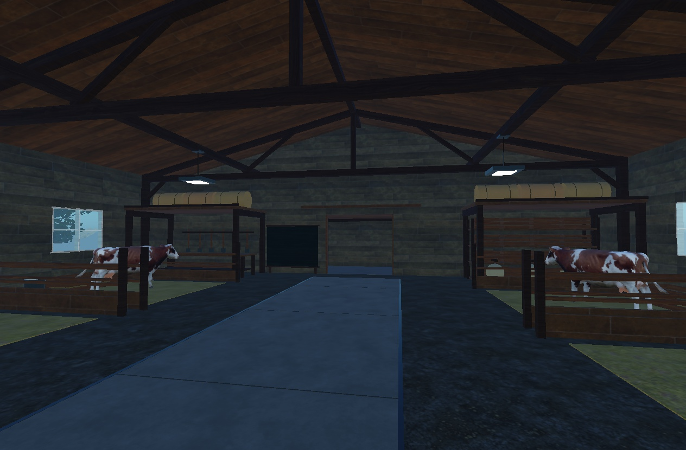

# Farm Tycoon Field Guide

The [public guide](https://ding-ding-projects.github.io/roblox-farm-tycoon-guide/) explains the current farming catalogue, its costs and timings, original world lore, and the evidence boundary for each feature. It is a documentation and status site, not a playable copy of the Roblox experience. The [wiki](https://github.com/Ding-Ding-Projects/roblox-farm-tycoon-guide/wiki) provides navigable reference pages. Public beta publication is pending verified live play.

Build locally on Windows with `build.bat`. The site itself is dependency-free static HTML, CSS, and JavaScript. The one-click script requires Node.js only to record build provenance and check the catalogue inventory. The supported hosted path is GitHub Pages from `main` at `/`.

Catalogue and evidence

The public catalogue snapshot is in `catalogue.js`; it records 7 crops, 31 items, 4 animals, 13 recipes, 14 buildings, and 4 upgrades from private game source commit `163c8305694d8a25b453031b4bc54bc431af4642`. `Observed locally` means a selected route has real Studio evidence, not that every path or the public server was verified. `In development` means the source defines the entry but the full playable route lacks acceptance. The guide's `release.json` records the running guide version and build time.

The two site images are reviewed original game captures already published in the [Farm Tycoon gallery](https://ding-ding-projects.github.io/roblox-farm-tycoon-gallery/). The root `social-preview.png` is the same genuine barn capture, not a fabricated UI image.

Project records

- [Roadmap](ROADMAP.md)
- [Handoff](HANDOFF.md)
- [Guide feature article](docs/guide/catalogue.md)
- [World lore article](docs/guide/lore.md)

