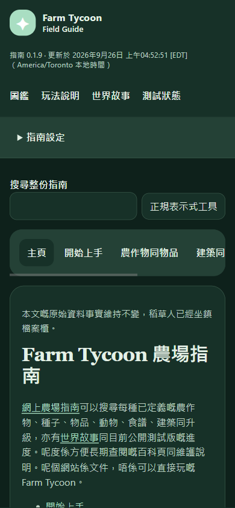
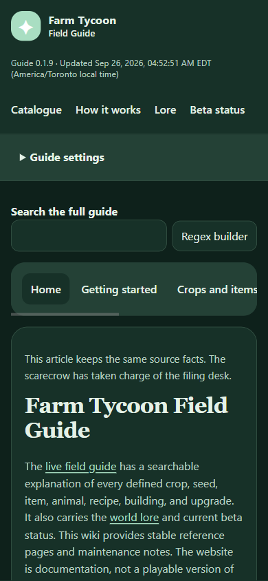
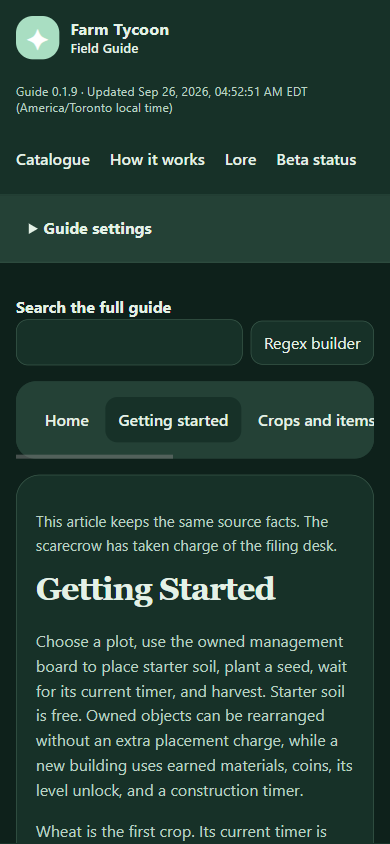
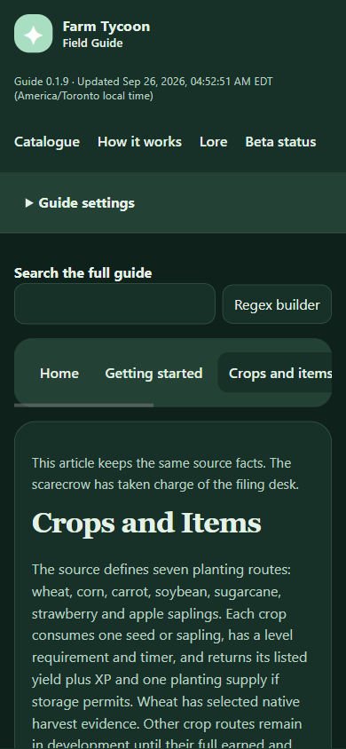
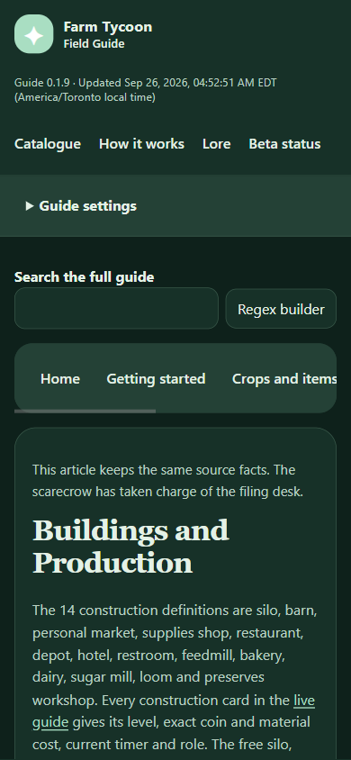
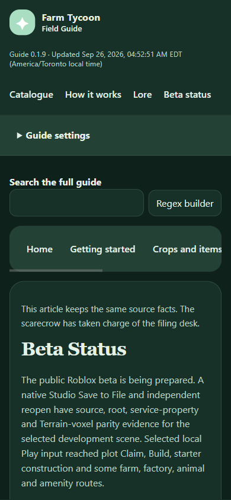

# Running version surface inventory

Every route below has its own visible version marker in the header before navigation. `release.json` supplies the guide version, UTC build time and source commit. `version.js` formats that time in the visitor's local timezone with seconds and an explicit timezone name; invalid or unavailable provenance leaves an honest unavailable label. The value is guide build provenance, not the time the visitor opened the page.

| Route | Marker | Runtime | Focused source check | Built interaction and capture |
| --- | --- | --- | --- | --- |
| `index.html` | `version-line` | `app.js` | `tools/check.mjs`, `tools/check-version-negative.mjs` | Live 0.1.9 Home at 390 by 844 emulated mobile showed the version before navigation, persisted Cantonese settings, no body overflow, 20 named controls, visible keyboard focus, and zero observed console or network errors. [Inspected settings capture](../captures/guide-home-yue-dark-settings-0.1.9.png) and [inventory](../capture-inventory.json). The earlier [0.1.6 capture](../captures/guide-home-mobile-0.1.6.png) remains historical. |
| `wiki/index.html` | `wiki-version` | `wiki.js` | Same checks | Live 0.1.9 Cantonese index at 390 by 844: 26 named controls, front-screen version, no body overflow or observed console and network errors. [Capture below](#wiki-route-gallery). |
| `wiki/Home.html` | `wiki-version` | `wiki.js` | Same checks | Live 0.1.9 English article at 390 by 844: 26 named controls, front-screen version, no body overflow or observed console and network errors. [Capture below](#wiki-route-gallery). |
| `wiki/Getting-Started.html` | `wiki-version` | `wiki.js` | Same checks | Live 0.1.9 English article at 390 by 844: 22 named controls, front-screen version, no body overflow or observed console and network errors. [Capture below](#wiki-route-gallery). |
| `wiki/Crops-and-Items.html` | `wiki-version` | `wiki.js` | Same checks | Live 0.1.9 English article at 390 by 844: 21 named controls, front-screen version, no body overflow or observed console and network errors. [Capture below](#wiki-route-gallery). |
| `wiki/Buildings-and-Production.html` | `wiki-version` | `wiki.js` | Same checks | Live 0.1.9 English article at 390 by 844: 20 named controls, front-screen version, no body overflow or observed console and network errors. [Capture below](#wiki-route-gallery). |
| `wiki/World-Lore.html` | `wiki-version` | `wiki.js` | Same checks | Live 0.1.9 World Lore at 390 by 844 emulated mobile showed the Cantonese version before navigation, 20 named controls, visible keyboard focus, no body overflow, and zero observed console or network errors. [Inspected article capture](../captures/guide-world-lore-yue-mobile-0.1.9.png) and [inventory](../capture-inventory.json). |
| `wiki/Beta-Status.html` | `wiki-version` | `wiki.js` | Same checks | Live 0.1.9 English article at 390 by 844: 20 named controls, front-screen version, no body overflow or observed console and network errors. [Capture below](#wiki-route-gallery). |

The marker and fallback text are in each page's static HTML, so a network or script failure does not invent a date. The source checks verify the release record, the source commit's package version, local formatting with seconds and timezone, all eight front-screen markers, and deliberate red results after removing each marker or provenance field. Home and all seven wiki entry points now have representative live 0.1.9 route captures. The screenshots prove the recorded English or Cantonese state at an emulated mobile viewport; they do not prove every language, theme, scale, search path, or physical device on every route. Desktop capture promotion and the broader per-page feature inventory remain open.

## Wiki route gallery

Every image below is an unchanged live capture. The [capture inventory](../capture-inventory.json) records the exact Pages source, UTC capture time, SHA-256, viewport and privacy review for each route.

### Wiki index, Cantonese

### Wiki Home, English

### Getting Started, English

### Crops and Items, English

### Buildings and Production, English

### Beta Status, English

